#  Automated Jenkins Job Triggered by Access Log Size

This project implements an **automated log management system** that monitors the size of an Apache access log file on an EC2 instance. When the log file exceeds **1GB**, a shell script automatically triggers a Jenkins job that uploads the log to **Amazon S3** and clears the original file — preventing storage overflow without any manual intervention.


##  Architecture

```
             User Traffic
                  │
                  ▼
        Apache Web Server (EC2)
                  │
        Access Log File Generated
      /var/log/apache2/access.log
                  │
                  ▼
        Monitoring Script (Shell)
            monitor_log.sh
                  │
         Cron Job (Runs every 5 min)
                  │
                  ▼
            Trigger Jenkins Job
                  │
                  ▼
              Jenkins Server
        upload-accesslog-to-s3 Job
                  │
                  ▼
        Upload Log File to S3 Bucket
                  │
                  ▼
         Amazon S3 (Log Storage)
                  │
                  ▼
        Clear Original Log File
```

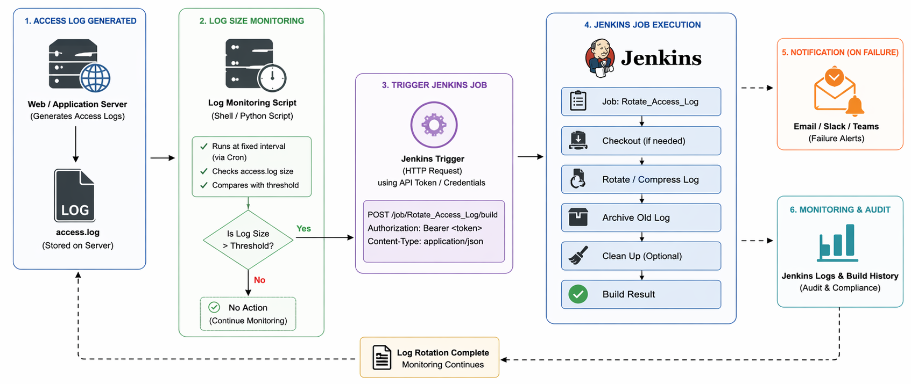

| Component | Value |
|---|---|
| **Instance Type** | t2.micro |
| **OS** | Ubuntu (Linux) |
| **Open Ports** | 22 (SSH), 8080 (Jenkins), 80 (HTTP) |
| **Region** | ap-south-1 (Mumbai) |
| **Log File Path** | `/var/log/apache2/access.log` |
| **S3 Bucket** | `jenkins-accesslog-bucket-2026` |
| **Trigger Threshold** | 1 GB |
| **Cron Interval** | Every 5 minutes |


##  Project Theory & Background

### What is Apache Access Log?

Apache Web Server records every incoming HTTP request in an **access log** file located at `/var/log/apache2/access.log`. Over time, high-traffic servers generate massive log files that can fill up disk storage and degrade server performance.

### Why Automate Log Management?

| Problem | Solution |
|---|---|
| Log files grow unbounded | Monitor size with a shell script |
| Manual upload is error-prone | Jenkins job automates the transfer |
| Logs lost after deletion | Archive to Amazon S3 before clearing |
| Requires constant human attention | Cron job runs every 5 minutes automatically |

### What is Jenkins?

**Jenkins** is an open-source automation server used for CI/CD pipelines. In this project, it is used as a **job runner** — triggered via REST API by an external monitoring script to execute shell commands on the server.

### What is AWS S3?

**Amazon S3 (Simple Storage Service)** is a scalable object storage service. It is used here as a **log archive** — every time a log file exceeds 1GB, it is uploaded to S3 before being cleared, ensuring no data is ever permanently lost.

### What is a Cron Job?

A **cron job** is a time-based scheduler in Linux. The syntax `*/5 * * * *` means "run this command every 5 minutes." Here it invokes `monitor_log.sh` regularly so the system responds quickly to any log size threshold breach.

### Project Workflow

1. Apache server generates an access log file.
2. A monitoring shell script checks the log file size every 5 minutes via cron.
3. If the log size exceeds **1GB**, the script triggers a Jenkins job via REST API.
4. Jenkins copies the log, uploads it to **Amazon S3**, then clears the original file.
5. The full cycle runs automatically with no manual steps required.


##  AWS Services Used

| Service | Purpose |
|---|---|
| **Amazon EC2** | Hosts Apache and Jenkins |
| **Apache Web Server** | Generates the access log |
| **Jenkins** | Runs the upload and cleanup job |
| **AWS S3** | Stores archived log files |
| **AWS CLI** | Executes S3 commands from Jenkins |
| **AWS IAM** | Manages access keys and user permissions |
| **Shell Scripting** | Monitors log size, triggers Jenkins |
| **Cron** | Schedules the monitoring script |


##  Project Implementation

### 1️. Launch EC2 Instance

An EC2 instance was launched in `ap-south-1` to host both Apache Web Server and Jenkins.

- **Instance Name:** `jenkins-log-project`
- **Instance Type:** `t2.micro`
- **AMI:** Ubuntu
- **Open Ports:** 22 (SSH), 8080 (Jenkins), 80 (HTTP)

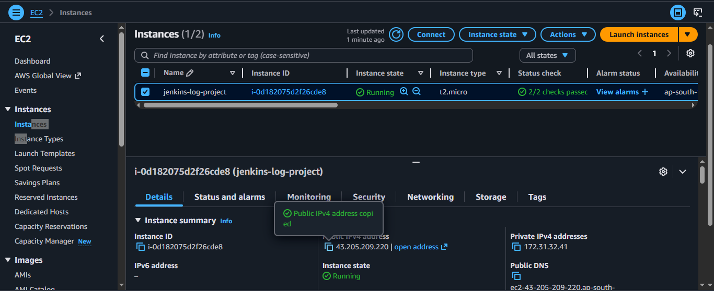

---

### 2️. Install and Start Apache Web Server

Apache was installed to generate the access log that will be monitored.

```bash
sudo apt update
sudo apt install apache2 -y
sudo systemctl start apache2
sudo systemctl enable apache2
sudo systemctl status apache2
```

Access log file location:

```
/var/log/apache2/access.log
```

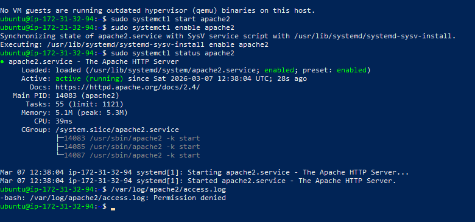

---

### 3️. Install and Start Jenkins

Jenkins was installed to serve as the job runner, triggered via REST API by the monitoring script.

```bash
sudo apt update
sudo apt install openjdk-17-jdk -y
wget https://pkg.jenkins.io/debian-stable/binary/jenkins_2.452.1_all.deb
sudo dpkg -i jenkins_2.452.1_all.deb
sudo systemctl start jenkins
sudo systemctl enable jenkins
sudo systemctl status jenkins
```

Open Jenkins in your browser:

```
http://<EC2-PUBLIC-IP>:8080
```

Retrieve the initial admin password:

```bash
sudo cat /var/lib/jenkins/secrets/initialAdminPassword
```

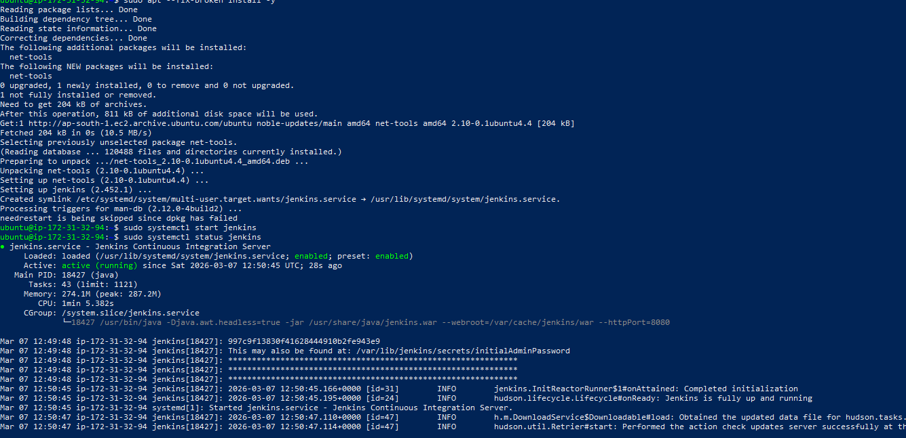


---

### 4️. Install AWS CLI

AWS CLI was installed to enable S3 operations from within the Jenkins job.

```bash
sudo apt install unzip -y
curl "https://awscli.amazonaws.com/awscli-exe-linux-x86_64.zip" -o "awscliv2.zip"
unzip awscliv2.zip
sudo ./aws/install
aws --version
```

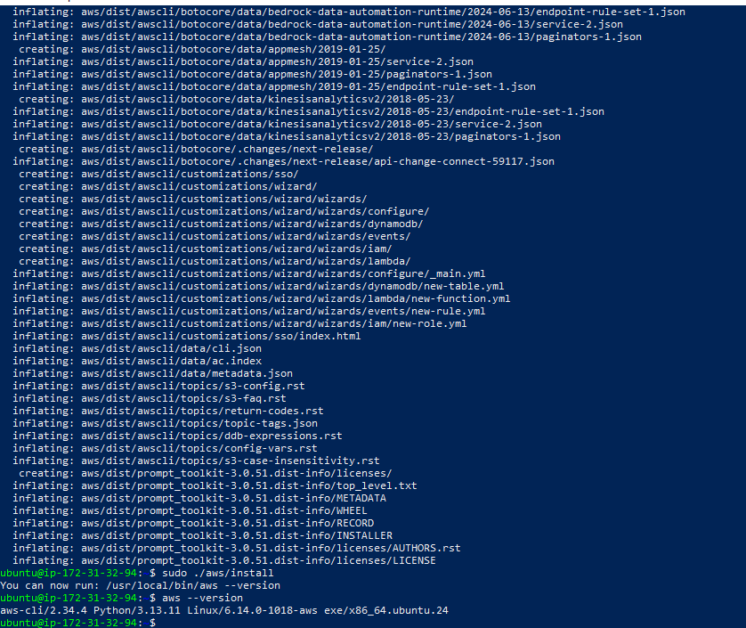

---

### 5️. Create IAM User and Access Key

An IAM user named `jenkins-user` was created in AWS with programmatic access and S3 permissions. An access key was generated for use with AWS CLI.

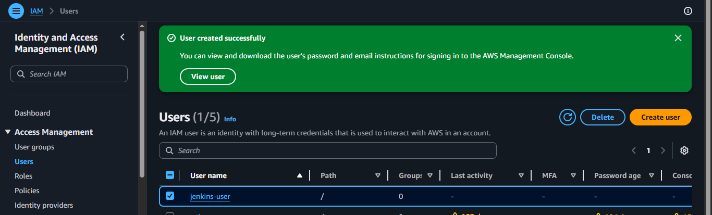

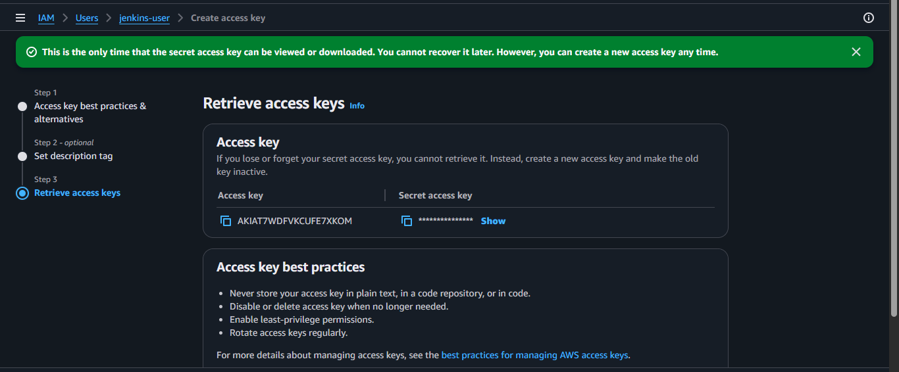

> ⚠️ **Security Note:** The secret access key is shown only once at creation. Store it securely — you cannot retrieve it later.

---

### 6️. Configure AWS CLI & Create S3 Bucket

AWS CLI was configured for both the `ubuntu` and `jenkins` users, and the S3 bucket was created.

**Configure AWS CLI (ubuntu user):**

```bash
aws configure
# AWS Access Key: <your-key>
# AWS Secret Key: <your-secret>
# Region: ap-south-1
# Output format: json

aws s3 ls
```

**Create the S3 bucket:**

```bash
aws s3 mb s3://jenkins-accesslog-bucket-2026 --region ap-south-1
aws s3 ls
```

**Configure AWS CLI for Jenkins user:**

```bash
sudo su - jenkins
aws configure
aws s3 ls
exit
```

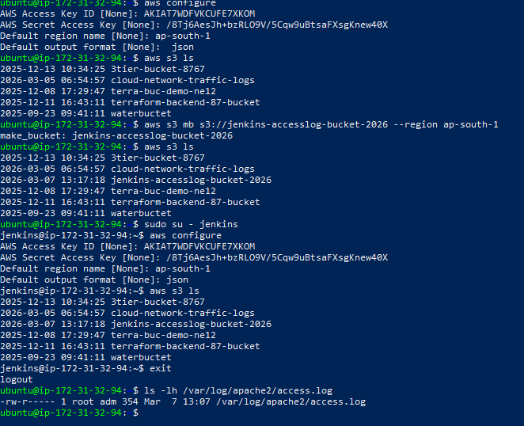

---

### 7️. Create Jenkins Job

A Freestyle Jenkins job named `upload-accesslog-to-s3` was created to handle the log upload and cleanup.

**Job Name:** `upload-accesslog-to-s3`
**Job Type:** Freestyle Project

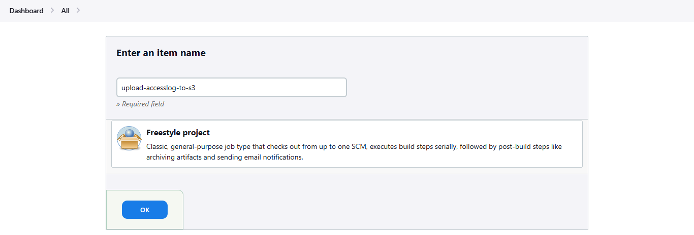

**Build Step → Execute Shell:**

```bash
LOG_FILE="/var/log/apache2/access.log"
TEMP_FILE="/tmp/access.log"
BUCKET="s3://jenkins-accesslog-bucket-2026"

echo "Copying log file..."
sudo cp $LOG_FILE $TEMP_FILE

echo "Uploading log file to S3..."
aws s3 cp $TEMP_FILE $BUCKET/access.log

if [ $? -eq 0 ]; then
    echo "Upload successful. Clearing log file..."
    sudo truncate -s 0 $LOG_FILE
else
    echo "Upload failed."
fi
```

---

### 8️. Verify Apache Access Log

Before testing, the Apache access log was verified to confirm it is being populated with incoming HTTP requests.

```bash
sudo tail /var/log/apache2/access.log
```

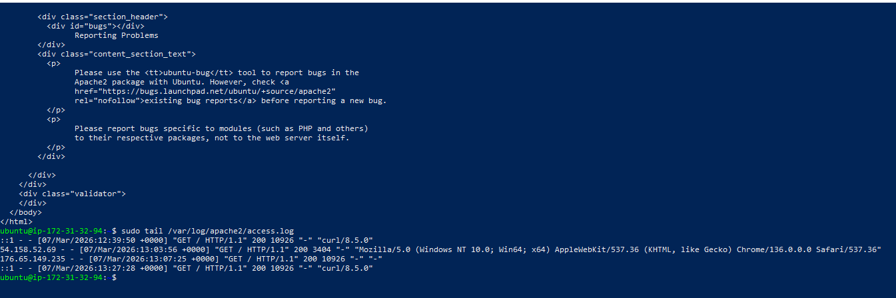

---

### 9️. Create Monitoring Script & Configure Cron

A shell script was written to check the log file size and trigger the Jenkins job automatically.

**Create the script:**

```bash
nano monitor_log.sh
```

**Script content:**

```bash
#!/bin/bash

LOG_FILE="/var/log/apache2/access.log"
MAX_SIZE=$((1024*1024*1024))
JENKINS_URL="http://localhost:8080/job/upload-accesslog-to-s3/build"

FILE_SIZE=$(stat -c%s "$LOG_FILE")

echo "Current log size: $FILE_SIZE bytes"

if [ $FILE_SIZE -ge $MAX_SIZE ]; then
    echo "Log file exceeded 1GB. Triggering Jenkins job..."
    curl -X POST $JENKINS_URL
else
    echo "Log file size is under limit."
fi
```

**Make the script executable and test it:**

```bash
chmod +x monitor_log.sh
./monitor_log.sh
```

**Schedule with Cron (every 5 minutes):**

```bash
crontab -e
```

Add the following line:

```bash
*/5 * * * * /home/ubuntu/monitor_log.sh >> /home/ubuntu/log_monitor.log 2>&1
```

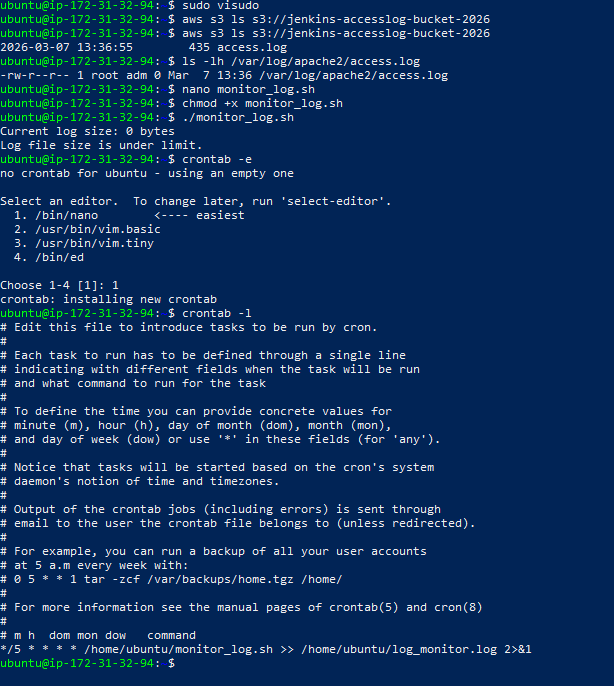

---

### 🔟 Verify Jenkins Build Success

After triggering the Jenkins job (either manually or automatically via the monitoring script), the build console output confirms the log was copied, uploaded to S3, and the original file was cleared.

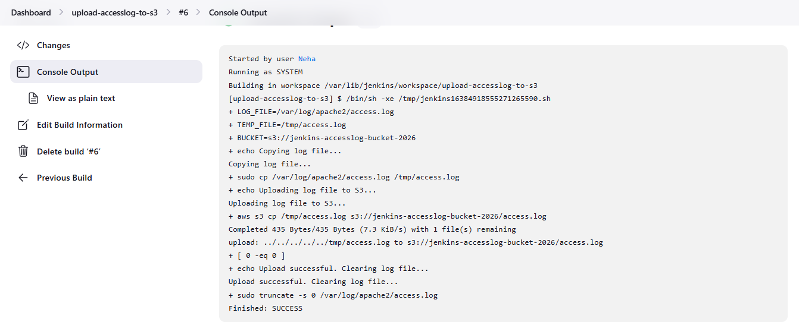


##  Challenges & Fixes

| Challenge | Fix Applied |
|---|---|
| Jenkins REST API trigger returning 403 | Configured Jenkins to allow anonymous build triggers or used API token authentication |
| `aws s3 cp` failing in Jenkins job | Configured AWS CLI separately under the `jenkins` user with `sudo su - jenkins` |
| Apache log permission denied | Used `sudo cp` to copy the log to `/tmp` before uploading |
| `truncate` command not clearing log | Used `sudo truncate -s 0 $LOG_FILE` to ensure correct permissions |
| Cron not finding script path | Used absolute path `/home/ubuntu/monitor_log.sh` in crontab |


##  Summary

This project successfully demonstrates a complete, automated DevOps log management workflow:

- A **monitoring shell script** checks the Apache access log size every 5 minutes via cron
- When the file exceeds **1GB**, the Jenkins REST API is called to trigger a job automatically
- The **Jenkins job** copies the log, uploads it to **Amazon S3** using AWS CLI, and clears the original file
- **IAM user credentials** ensure secure, scoped access to S3 from both the ubuntu and jenkins users
- The entire pipeline runs without any manual intervention, demonstrating a real-world **DevOps automation** workflow


##  Author

**Prerana Lambhate**  
Cloud & DevOps Learner

📧 Email: preranalambhate@gmail.com  
🔗 LinkedIn: https://in.linkedin.com/in/prerana-lambhate-    
🌐 Portfolio: https://www.techprerana.cloud  
✍️ Medium: https://medium.com/@preranalambhate